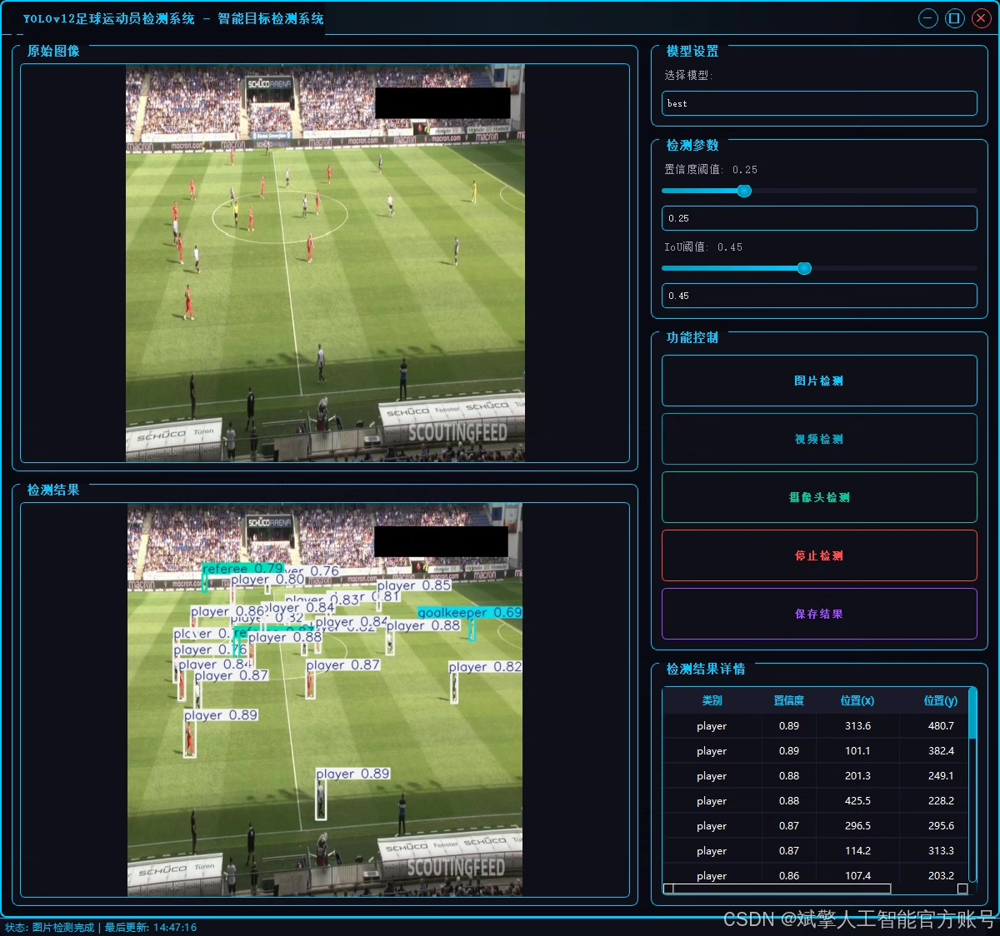
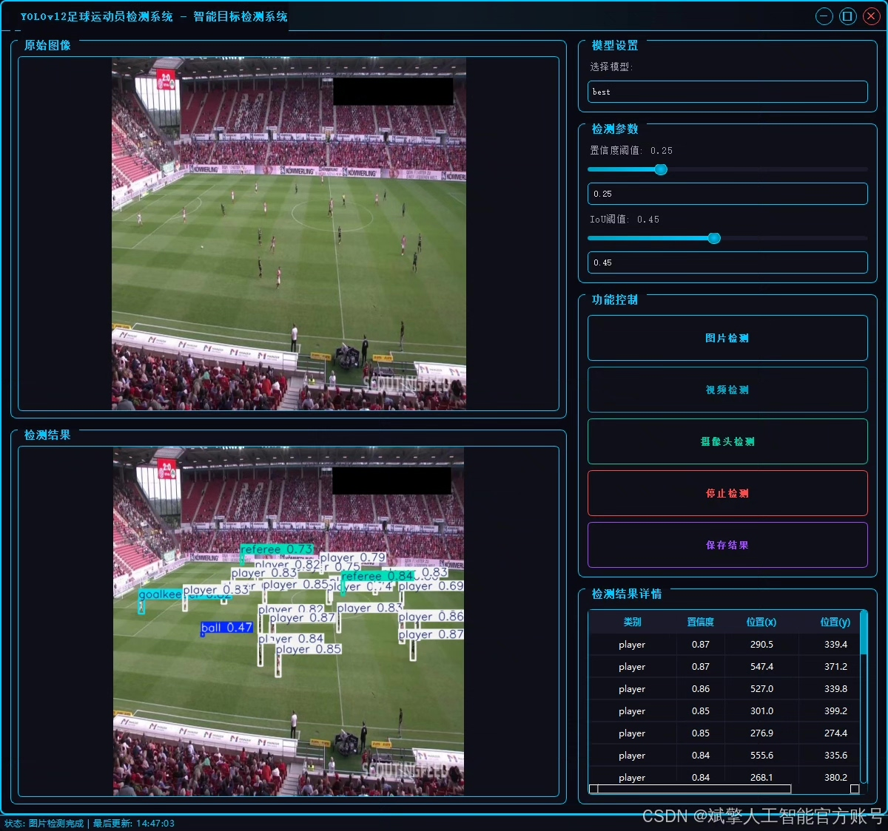
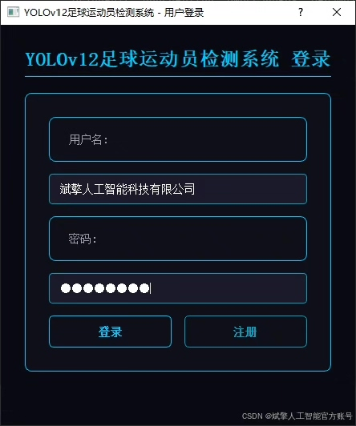
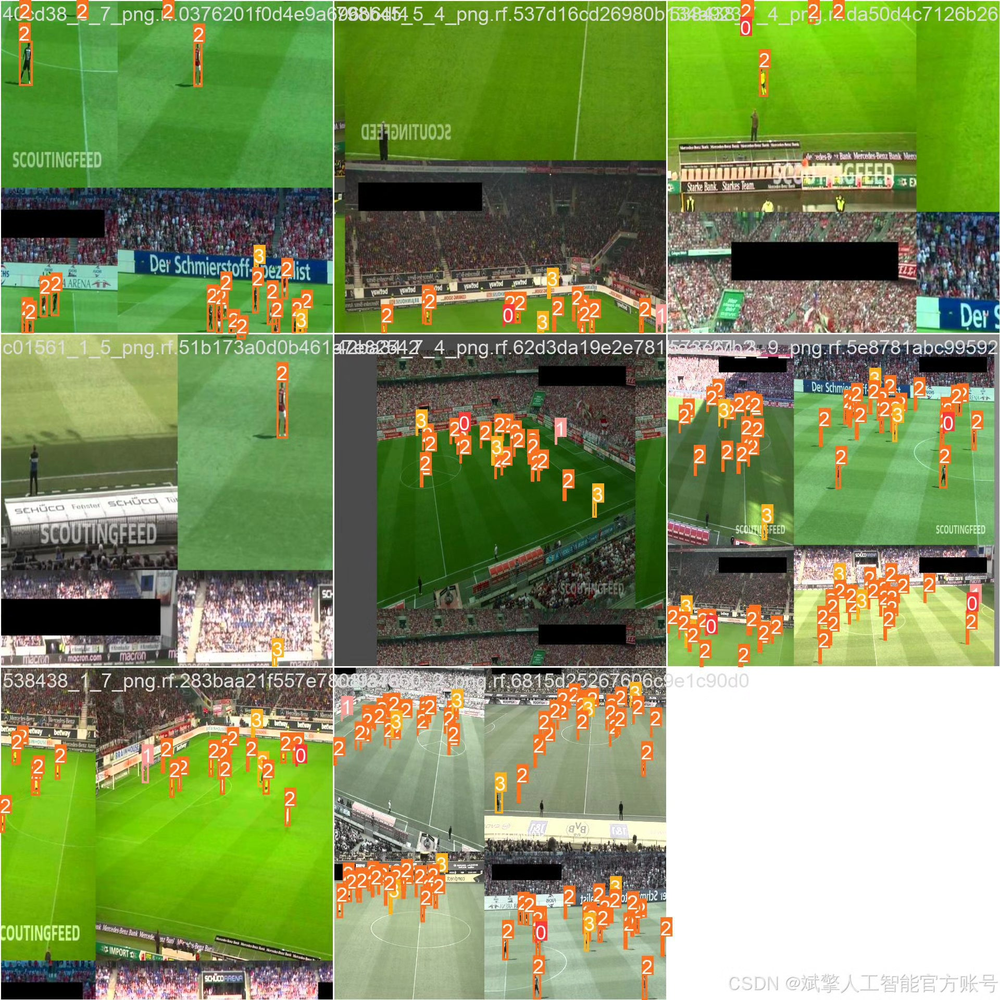
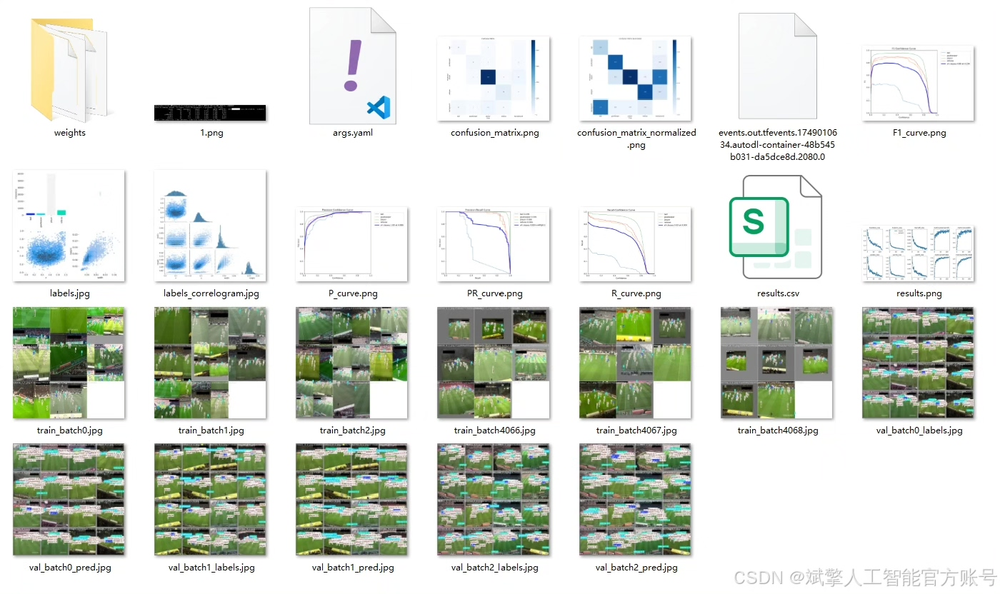
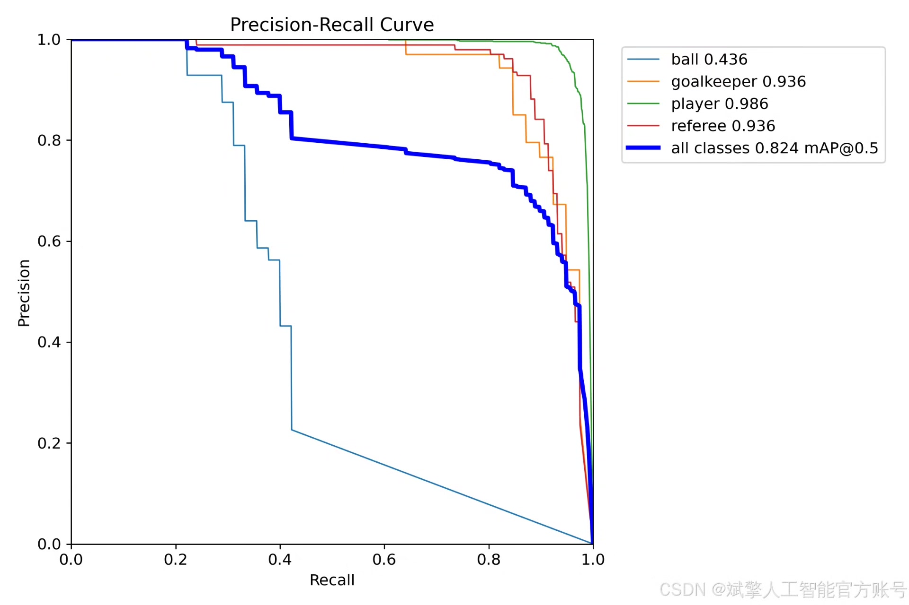
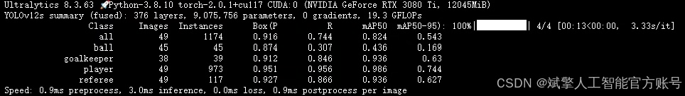
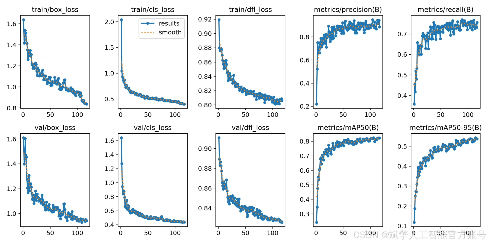
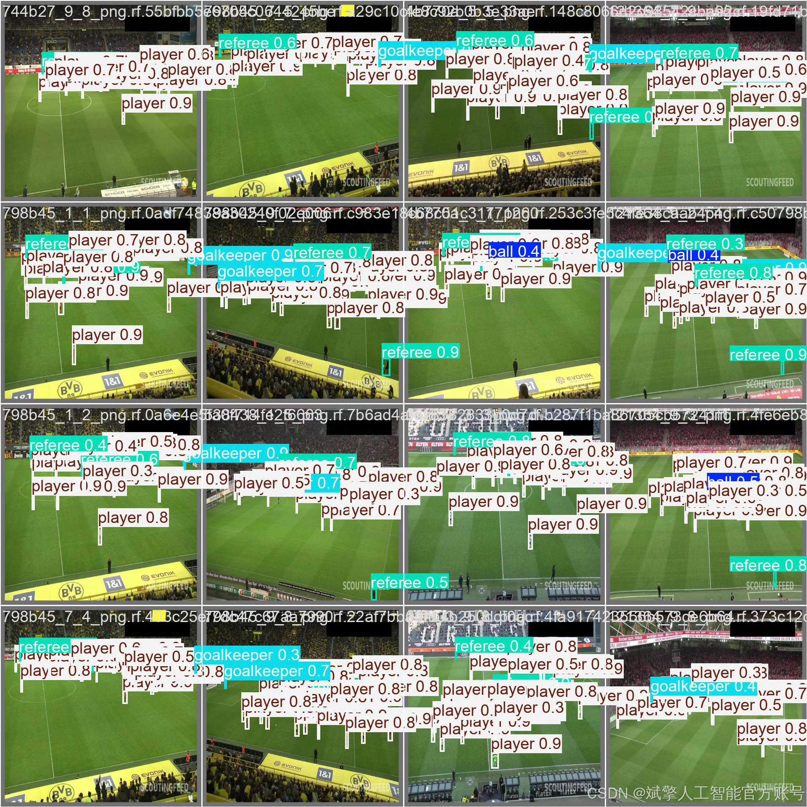

# YOLOv12 Football Player Detection System

## Body

This paper proposes a football player detection system based on the deep learning algorithm YOLOv12, aiming to achieve real-time detection and classification of athletes, goalkeepers, referees, and soccer balls on the football field. The system utilizes the YOLOv12 model, covering categories such as ball (soccer), goalkeeper (referee), player (athlete), and referee (judge). Additionally, the system features a user-friendly UI interface that supports login and registration functions. Experimental results show that the system performs well in the task of target detection in football scenarios, with high detection accuracy and real-time performance, suitable for applications such as football match analysis and intelligent referee assistance.

Dataset:
nc: 4
names: ['ball', 'goalkeeper', 'player', 'referee'],
dataset quantity: training set 298 images, validation set 49 images, test set 25 images.

✅ User login registration: Supports password verification and security validation.
✅ Three detection modes: Based on the YOLOv12 model, supporting image, video, and real-time camera detection, accurately identifying targets.
✅ Dual-screen comparison: Display original images and detection results on the same screen.
✅ Data visualization: Real-time table displaying the category, confidence, and coordinates of detected targets.
✅ Intelligent parameter adjustment: Offers a confidence slide bar for dynamic optimization of detection accuracy, adapting to different scene requirements.
✅ Sci-fi style interaction interface: Dark theme combined with dynamic light effects, reducing visual fatigue and enhancing operational experience.

## Images

## Payment

Here is a pay link on Stripe ( https://buy.stripe.com/3cs8yP7sY87d0vu9AB ). Please contact me lonlonago@foxmail.com after funding $89, and I will send you a complete data files , thank you!

